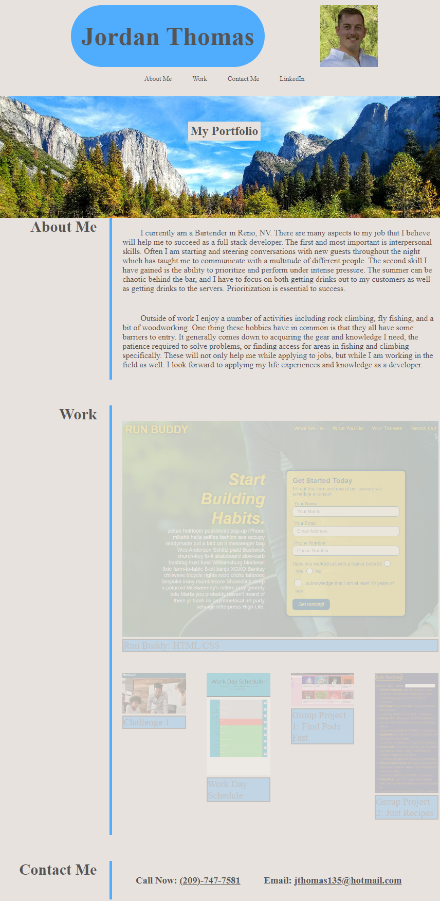

# Challenge-2

# Personal Portfolio

## **Description**

This project asked that I build an online portfolio for my work.

1. My first task was to set up the structure via html

2. I then added styles with css which allowed me to add a recent photo, clickable links for about me/work/contact me, and a hero background image.

3. I added flexboxes so that i could adjust how the page was displayed at different screen sizes.

4. I also added some mouse hover settings to the page as well as clickable phone and email contacts.

5. Lastly instead of a link to my resume I included a link to my linkedin profile.

## **Screenshot**

## **Link to Page and Repository**

1. Page:  https://jordanio49.github.io/Challenge-2/

2. Repository: https://github.com/Jordanio49/Challenge-2